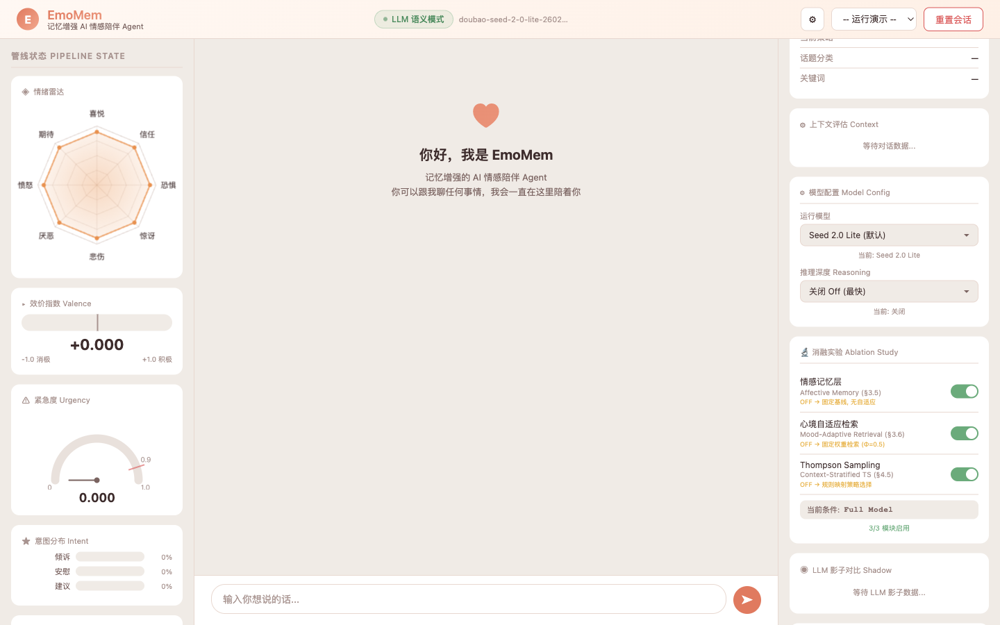

# EmoMem — Memory-Augmented AI Emotional Companion Agent

> 🌐 [中文版本 →](README_CN.md)

[](https://www.python.org/)
[](https://flask.palletsprojects.com/)
[](LICENSE)



---

## What is EmoMem?

EmoMem is a research prototype of a **memory-augmented emotional companion agent**. Unlike traditional chatbots that treat each conversation turn as independent, EmoMem builds a persistent, structured understanding of the user's emotional world — remembering past emotional episodes, learning what support strategies work for each individual, and tracking the user's long-term emotional recovery trajectory.

The system follows a **Perception → Planning → Action → Memory (PPAM)** architecture, where memory is not a passive log but the **central engine** that drives all other modules.

---

## Three Core Innovations

### 🔬 Innovation 1 — Affective Memory Tier

Most dialogue systems forget the user between sessions. EmoMem introduces a dedicated **Affective Memory Tier** that persists across conversations and stores:

| Component | What it tracks |
|---|---|
| **Emotion Baseline** | The user's typical emotional state (mean + variance per emotion dimension) |
| **Trigger–Emotion Map** | Which types of events (work, relationships, health…) are linked to which emotions for this user |
| **Recovery Curve** | How quickly this user typically bounces back from negative episodes |
| **Strategy Effectiveness** | Which support strategies (validation, advice, reframing…) have worked well in the past |

This turns EmoMem from a stateless responder into an agent that **knows the user** — and adapts its behavior accordingly.

---

### 🔬 Innovation 2 — Mood-Adaptive Retrieval (MAR)

When retrieving past memories to inform a response, a naive system would always retrieve by recency or semantic similarity. EmoMem instead uses **MAR**, which dynamically adjusts retrieval weights based on the current emotional context and the planner's goal:

- **Emotional validation goal** → retrieve episodes where the user felt similar emotions (mood-congruent retrieval, grounded in Bower's 1981 mood-state-dependent memory theory)
- **Recovery goal** → retrieve episodes where the user successfully overcame similar difficulties (mood-incongruent / uplifting retrieval)
- **Crisis assessment goal** → retrieve behavioral pattern deviations from the affective baseline

The retrieval weight function:

$$\Phi = \alpha \cdot \text{sim}_{\text{emotion}} + \beta \cdot \text{sim}_{\text{semantic}} + \gamma \cdot \text{recency} + \delta \cdot \text{importance}$$

where $(\alpha, \beta, \gamma, \delta)$ are dynamically adjusted by the current planning objective rather than fixed.

---

### 🔬 Innovation 3 — Context-Stratified Thompson Sampling

EmoMem learns **which support strategy works best for this specific user** through a Contextual Bandit formulation:

- **Action space**: 9 support strategies drawn from Hill's (2009) Helping Skills Theory — Active Listening, Emotional Validation, Cognitive Reframing, Problem Solving, Psychoeducation, and more
- **Context features**: emotion type, urgency level, recovery phase, relationship depth, user intent
- **Learning mechanism**: Thompson Sampling with per-strategy Beta distributions, stratified by context cluster — balancing exploration (trying new strategies) with exploitation (using what has worked)

This moves EmoMem from *generic empathy* to **personalized support** — the same user asking "I'm feeling lost" on day 1 vs. day 30 will receive qualitatively different responses because the agent has learned their preferences.

---

## Architecture Overview

```
┌─────────────────────────────────────────────────────────────────┐
│                     EmoMem PPAM Architecture                     │
│                                                                  │
│  User Input                                                      │
│      │                                                           │
│      ▼                                                           │
│  ┌──────────┐   StateVector   ┌──────────────────────────┐      │
│  │PERCEPTION│ ─────────────→  │        MEMORY            │      │
│  │          │   MemoryQuery   │  ┌────────────────────┐  │      │
│  │ • Emotion│ ─────────────→  │  │ Working Memory     │  │      │
│  │   Radar  │                 │  │ Episodic Memory    │  │      │
│  │ • Intent │                 │  │ Affective Tier ★   │  │      │
│  │ • Urgency│                 │  │ Semantic Memory    │  │      │
│  └──────────┘                 │  └────────────────────┘  │      │
│                               └────────┬─────────────────┘      │
│                         RetrievedContext│  GroundingFacts        │
│                                        ▼                         │
│                               ┌──────────────┐                  │
│                               │   PLANNING   │                  │
│                               │ • Trajectory │                  │
│                               │   Modeling   │                  │
│                               │ • Thompson   │                  │
│                               │   Sampling ★ │                  │
│                               └──────┬───────┘                  │
│                               StrategyPlan │                     │
│                                        ▼                         │
│                               ┌──────────────┐                  │
│                               │    ACTION    │ → Response        │
│                               └──────┬───────┘                  │
│                          EpisodeRecord│(async)                   │
│                                        ▼                         │
│                               Feedback → Memory Update           │
└─────────────────────────────────────────────────────────────────┘
```

**★** = core innovations unique to EmoMem

---

## Emotion Model

EmoMem uses the **Plutchik 8-dimensional emotion model** rather than simple positive/negative classification:

```
joy · trust · fear · surprise · sadness · disgust · anger · anticipation
```

Each turn produces an `EmotionVector`:
- **e(t)** — probability distribution over 8 emotions (sums to 1)
- **ι(t)** — overall intensity [0, 1]
- **κ(t)** — recognition confidence [0, 1] — when low, the agent asks clarifying questions instead of assuming the user's emotional state

Scalar **valence** is computed as a weighted sum, tracking the user's emotional trajectory over time.

---

## Recovery Trajectory

EmoMem models the user's emotional arc across four phases:

```
Trough → Recovery → Consolidation → Stable
```

The planner selects different strategies depending on the current phase — in the Trough phase it prioritizes validation and safety; in the Consolidation phase it reinforces positive coping patterns.

---

## Project Structure

```
emomem_v1/
├── src/
│   ├── main.py          # EmoMemAgent — top-level orchestrator
│   ├── perception.py    # Emotion recognition, intent classification, urgency scoring
│   ├── memory.py        # 4-tier memory: working / episodic / affective / semantic
│   ├── planning.py      # Recovery trajectory + Thompson Sampling strategy selection
│   ├── action.py        # Response generation with memory grounding
│   ├── adaptation.py    # Feedback processing & online learning
│   ├── models.py        # Core data models (StateVector, EpisodeRecord, etc.)
│   ├── llm_provider.py  # Multi-backend LLM abstraction layer
│   ├── mock_llm.py      # Rule-based fallback (no API key required)
│   └── config.py        # All system parameters in one place
├── web/
│   ├── index.html       # Chat UI with real-time state visualization
│   └── server.py        # Flask REST API server
├── tests/
│   ├── test_unit.py         # Unit tests for individual modules
│   ├── test_integration.py  # End-to-end pipeline tests
│   ├── test_emotion.py      # Emotion model correctness
│   ├── test_crisis.py       # Crisis detection & safety protocol
│   └── llm_judge.py         # LLM-as-judge evaluation framework
└── docs/
    └── screenshot.png
```

---

## Quick Start

### 1. Install dependencies

```bash
pip install flask flask-cors anthropic openai
```

### 2. Configure your API key

EmoMem supports multiple LLM backends. Set one of the following:

**Option A — Volcengine ARK (Doubao Seed):**
```bash
export OPENAI_API_KEY=your_ark_api_key
export OPENAI_BASE_URL=https://ark.cn-beijing.volces.com/api/v3/
```

**Option B — Anthropic Claude:**
```bash
export ANTHROPIC_API_KEY=your_anthropic_key
```

**Option C — No API key (Mock mode):**
The system automatically falls back to a rule-based mock provider. All features work; responses are template-based.

> In `src/llm_provider.py`, replace `"please enter your token"` in `_ARK_API_KEYS` with your own key, or use environment variables instead.

### 3. Run the web interface

```bash
cd emomem_v1
python -m web.server
# Open http://127.0.0.1:8080
```

### 4. Run tests

```bash
pytest tests/
# Or with verbose output:
pytest tests/ -v
```

---

## Web UI Features

The interface provides a real-time view of the agent's internal state:

| Panel | Description |
|---|---|
| **Emotion Radar** | Live 8-axis Plutchik visualization |
| **Valence Index** | Continuous emotional valence score (−1 to +1) |
| **Urgency Gauge** | Crisis risk score; triggers safety protocol at 0.9 |
| **Intent Distribution** | Top-3 detected user intents with probabilities |
| **Recovery Timeline** | Current phase in the 4-stage recovery model |
| **Ablation Study** | Toggle Affective Memory / MAR / Thompson Sampling on/off |
| **LLM Shadow Mode** | Compare LLM-assessed values vs. formula-computed values |
| **Strategy History** | Log of strategies selected over the session |
| **Memory State** | Episodic count, archived episodes, baseline confidence |

---

## Environment Variables

| Variable | Description | Default |
|---|---|---|
| `OPENAI_API_KEY` | ARK or OpenAI-compatible key | — |
| `ANTHROPIC_API_KEY` | Anthropic Claude key | — |
| `OPENAI_BASE_URL` | Base URL for OpenAI-compatible endpoints | `https://ark.cn-beijing.volces.com/api/v3/` |
| `EMOMEM_LLM_PROVIDER` | `anthropic` / `openai` / `mock` | auto-detect |
| `EMOMEM_LLM_MODEL` | Model name override | `doubao-seed-2-0-lite-260215` |
| `EMOMEM_REASONING_EFFORT` | Reasoning depth: `off` / `low` / `medium` / `high` | `off` |

---

## REST API

| Method | Endpoint | Description |
|---|---|---|
| POST | `/api/chat` | Send a message; returns agent response + full state |
| POST | `/api/reset` | Reset the session (preserves LLM config) |
| GET | `/api/state` | Get current agent state without sending a message |
| GET | `/api/status` | System status (LLM mode, model, total turns) |
| GET/POST | `/api/config` | Get or update LLM configuration |
| GET/POST | `/api/reasoning` | Get or set reasoning effort level |
| POST | `/api/demo` | Run a preset demo scenario (`work_stress` / `crisis` / `recovery`) |
| GET/POST | `/api/ablation` | Get or toggle ablation study module switches |

---

## Research Context

EmoMem sits at the intersection of three active research areas:

- **AI companion systems** — long-term emotional support for loneliness and mental well-being
- **Memory-augmented agents** — persistent, structured user modeling beyond single-session context windows
- **Personalized strategy learning** — Bayesian online learning for individual-level support optimization

Key theoretical foundations: Plutchik's Emotion Wheel (2001), Hill's Helping Skills Theory (2009), Bower's Mood-State-Dependent Memory (1981), Gross's Emotion Regulation Process Model (1998), Thompson Sampling (Thompson, 1933), and the PPAM agent architecture (Wang et al., 2024).

---

## License

MIT
